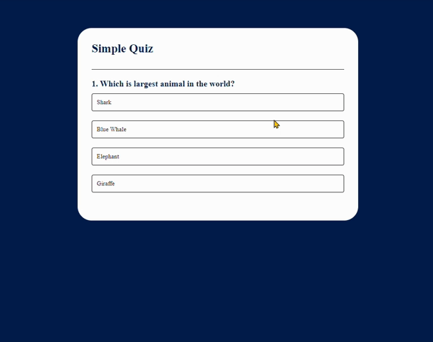

# Quiz Application ❓

## Overview
This project includes a simple quiz application where users can accumulate points by providing correct answers to specific questions.

### Technologies Used 🚀
- HTML
- CSS
- JavaScript



## Features ✨

1. Dynamic display of questions.

2. Coloring of answer options to quickly distinguish between correct and incorrect answers.

3. Point calculation system to track user performance.

4. Transition between questions and viewing the result screen.


## Installation
- Clone the repository to your local machine:
    ```bash
    git clone https://github.com/NisaGokdemir/quiz_app.git
- Open the project directory:
    ```bash
    cd quiz-app
- Open the index.html file in your web browser.


## Live Demo 🌐
Live Demo : 

## Contributing 🎯
Feel free to use and customize the project! If you have any questions or feedback, you can reach me at nisagokdemir@gmail.com. Enjoy!

## License
This project is licensed under the MIT License. For detailed information, see the LICENSE file.